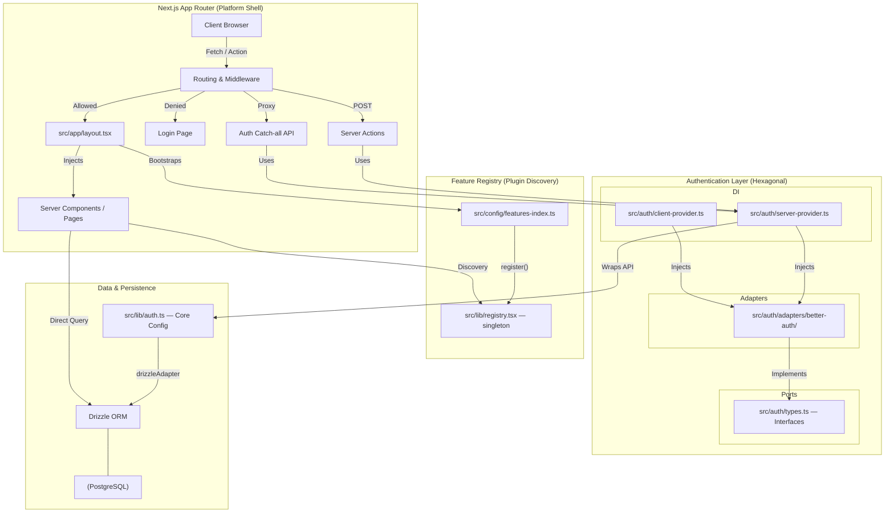
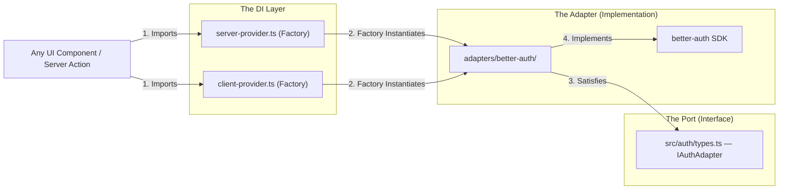
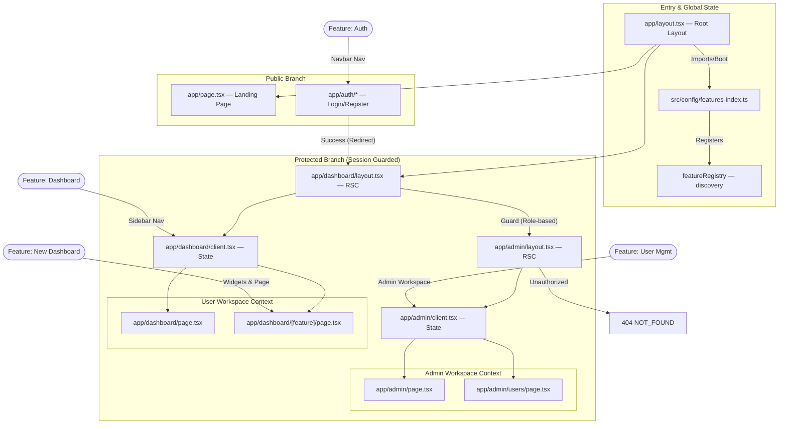
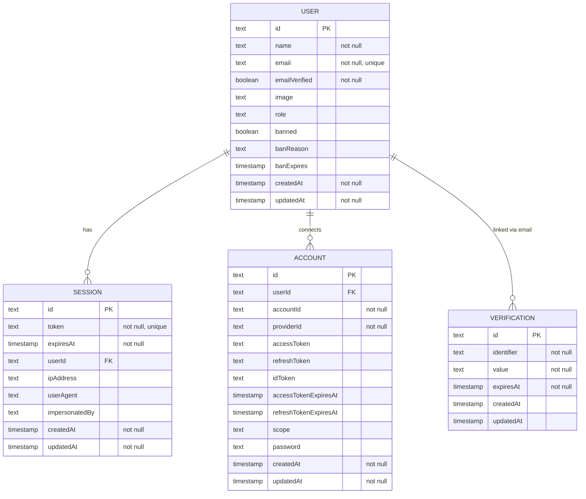
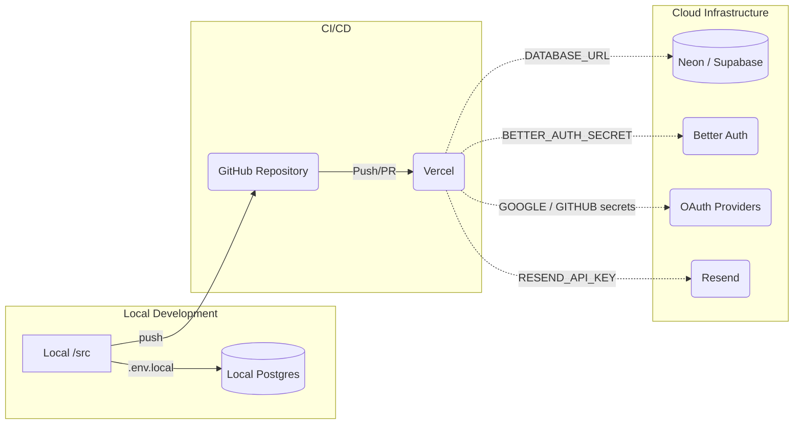

# Architecture: Multi-Tenant SaaS Starter

This document is the authoritative reference for the architecture, module boundaries, dependency model, and directory structure of this application.

---

## 1. High-Level Architecture & Data Flow

### 1.1 System Architecture Diagram



### 1.2 Deep Data Flow & Lifecycle Overview

The application follows a strictly sequenced initialization and request-response lifecycle to ensure architectural integrity:

1. **Edge Middleware & Proxy Shim:** Inbound requests are intercepted by `src/middleware.ts` and gated by the `src/proxy.ts` shim. This layer performs pre-flight authentication checks against the session store before any React rendering occurs.
2. **Registry Bootstrapping:** The `src/app/layout.tsx` (Root Layout) executes a blocking side-effect import of `src/config/features-index.ts`. This synchronously populates the `FeatureRegistry` singleton with all enabled feature metadata, ensuring the discovery engine is warm before children mount.
3. **Session Resolution (Inversion of Control):** Server Components resolve identity via the `src/auth/server-provider.ts` factory. This satisfies the **Dependency Inversion Principle** by providing an abstract `IAuthServerAdapter` instance, preventing the domain layer from depending on the Better Auth SDK directly.
4. **Declarative UI Discovery:** Layouts (Dashboard/Admin) query the singleton registry for role-filtered navigation and widget sets. The UI is **configuration-driven**—no feature-specific navigation logic is hardcoded into the platform shell.
5. **Streaming & Hydration:** React Server Components (RSC) stream HTML fragments to the client. Client-side state is managed via `useSession` from `src/auth/client-provider.ts` for reactive UI updates without full-page reloads.

---

## 2. Directory Structure

```text
multi-tenant-saas-starter/
├── .github/                    # CI/CD configurations
├── drizzle/                    # Drizzle-kit migrations output
├── plans/                      # Archived architectural planning docs
├── src/
│   ├── app/                    # Next.js App Router pages & endpoints
│   │   ├── admin/              # Admin workspace (RBAC protected)
│   │   │   ├── layout.tsx      # Enforces admin session
│   │   │   ├── page.tsx        # Admin overview page
│   │   │   ├── client.tsx      # Client boundary for admin layout
│   │   │   └── users/page.tsx  # User management table view
│   │   ├── api/
│   │   │   ├── auth/[...all]/route.ts   # Better Auth catch-all
│   │   │   └── admin/users/route.ts     # REST bridge for user listing
│   │   ├── auth/               # Public auth pages (login, register)
│   │   ├── dashboard/          # Authenticated user workspace
│   │   │   ├── layout.tsx      # Injects session, nav, bootstraps registry
│   │   │   ├── page.tsx        # Overview page → DashboardOverview
│   │   │   ├── client.tsx      # Client boundary for dashboard layout
│   │   │   └── [feature]/page.tsx  # Dynamic registry-driven feature pages
│   │   ├── globals.css         # Global CSS + Tailwind v4 theme tokens (OKLCH)
│   │   ├── layout.tsx          # Root layout — bootstraps feature registry
│   │   └── page.tsx            # Public marketing landing page
│   ├── auth/                   # Hexagonal Auth Layer (Ports & Adapters)
│   │   ├── types.ts            # IAuthServerAdapter / IAuthClientAdapter / GenericSession
│   │   ├── server-provider.ts  # Server-side adapter factory
│   │   ├── client-provider.ts  # Client-side adapter factory
│   │   └── adapters/
│   │       └── better-auth/    # Concrete Better Auth implementation
│   ├── config/
│   │   ├── features-index.ts   # Single source of truth for active features
│   │   └── types.ts            # Shared config types (NavItemList, etc.)
│   ├── db/
│   │   ├── index.ts            # Drizzle instance + pg connection
│   │   └── schema.ts           # Table definitions (user, session, account, verification)
│   ├── design-systems/         # UI primitive library split by origin
│   │   ├── shadcn/
│   │   │   ├── components/     # shadcn/ui components (sidebar, breadcrumb, etc.)
│   │   │   └── provider.tsx    # shadcn theme provider
│   │   └── radix/
│   │       ├── provider.tsx    # Radix Themes provider
│   │       ├── styles.css      # Radix base styles
│   │       └── tokens.ts       # Design token mappings
│   ├── features/               # Feature-Sliced Design domains
│   │   ├── auth/               # Identity UI & server actions
│   │   │   ├── api/            # login.ts, register.ts server actions
│   │   │   ├── components/     # login-form.tsx, register-form.tsx, password-input.tsx
│   │   │   ├── registry.ts     # authMetadata — public paths & navbar nav items
│   │   │   └── schemas/        # Zod validation schemas
│   │   ├── dashboard/          # Core dashboard shell
│   │   │   ├── components/
│   │   │   │   ├── layout/     # dashboard-layout.tsx, dashboard-sidebar.tsx
│   │   │   │   └── overview/   # dashboard-overview.tsx
│   │   │   ├── config/         # dashboard-config.ts
│   │   │   └── registry.ts     # dashboardMetadata — sidebar nav + quick actions
│   │   ├── marketing/          # Public site components (no registry.ts — imported directly by app/page.tsx)
│   │   │   └── components/     # animated-hero.tsx, features-grid.tsx, footer.tsx, navbar.tsx, tech-stack.tsx
│   │   ├── new-dashboard/      # Analytics / Global Users feature module
│   │   │   ├── components/
│   │   │   │   ├── layout/     # (reserved — currently empty)
│   │   │   │   └── map/        # (reserved — currently empty)
│   │   │   ├── config/         # (reserved — currently empty)
│   │   │   └── registry.tsx    # newDashboardMetadata — sidebar nav, widgets, page (inline placeholder components)
│   │   ├── user-management/    # Administrative user control feature
│   │   │   ├── api/            # admin-actions.ts, get-users.ts server actions
│   │   │   ├── components/
│   │   │   │   ├── dialogs/    # user-add, user-ban, user-unban, user-delete,
│   │   │   │   │               #   user-revoke-sessions, user-role dialogs
│   │   │   │   └── table/      # users-table.tsx, users-table-columns.ts,
│   │   │   │                  #   users-table-toolbar.tsx, users-table-pagination.tsx,
│   │   │   │                  #   users-table-skeleton.tsx, user-actions.tsx
│   │   │   ├── config/         # Admin config definitions
│   │   │   ├── hooks/          # Domain-bound hooks (e.g. use-users-table)
│   │   │   ├── registry.ts     # userManagementMetadata — adminOnly sidebar nav
│   │   │   ├── types/          # Domain-local types
│   │   │   └── utils/          # Domain-local formatting utilities
│   │   └── vibe-check/         # Stub/reserved feature slot (empty directory)
│   ├── hooks/                  # Global shared React hooks
│   ├── lib/
│   │   ├── auth.ts             # Better Auth core server config
│   │   ├── config.ts           # App-level config constants
│   │   ├── email.ts            # Resend email integration
│   │   ├── public-paths.ts     # Static path whitelist (middleware bypass)
│   │   ├── registry.tsx        # FeatureRegistry class + featureRegistry singleton
│   │   ├── schemas.ts          # Shared Zod validation schemas
│   │   └── utils.ts            # cn() utility (clsx + tailwind-merge)
│   └── proxy.ts                # Auth proxy abstraction shim
├── components.json             # shadcn/ui registry config
├── drizzle.config.ts           # Drizzle-kit configuration
├── next.config.ts              # Next.js configuration
├── package.json                # Dependencies (pnpm)
└── tsconfig.json               # TypeScript configuration
```

---

## 3. Hexagonal Auth Layer (`src/auth/`)

The architecture employs a **Ports & Adapters (Hexagonal)** pattern to decouple the application core from the identity provider SDK. This implementation enforces **Dependency Inversion**; UI components and server actions depend solely on abstract interfaces, while the concrete Better Auth SDK is encapsulated within an adapter.



### Key Interfaces (`src/auth/types.ts`)

| Interface | Implementation | Primary Responsibility |
|---|---|---|
| `IAuthServerAdapter` | `BetterAuthServerAdapter` | Server-side resolution: `getSession`, `listUsers`, `getRouteHandler`. |
| `IAuthClientAdapter` | `BetterAuthClientAdapter` | Client-side reactivity: `useSession`, `signOut`, OAuth flows. |
| `GenericSession` | Shared Object | Canonical session shape used throughout the domain layer. |

### Adapter Isolation & Factory Pattern

The `server-provider.ts` and `client-provider.ts` act as **Inversion of Control (IoC) Factories**. When a consumer requests an auth session, the factory instantiates the current active adapter (e.g., Better Auth) and returns it as a type-safe interface. 

**Architectural Benefits:**
- **Zero-Lock-in:** To replace Better Auth, we simply author a new adapter directory Satisfying the `IAuthAdapter` port.
- **Mockability:** For testing, we inject a `MockAuthAdapter` into the factory, allowing full simulation of auth states without network or database overhead.
- **Boundary Enforcement:** Any attempt to import the Better Auth SDK directly into a feature component results in a linting violation, preserving the hexagonal boundary.

---

## 4. Feature Registry Architecture

The platform employs a **Singleton-based Plug-and-Play Registry**. This architecture enables features to be fully self-describing; the platform shell (layouts/sidebars) has zero knowledge of specific features and instead queries the registry for capability resolution.

### 4.1 Registry Interface & Singleton (`src/lib/registry.tsx`)

The `FeatureRegistry` is a strictly typed singleton that maintains the central state of all active feature modules. It provides a standard interface for both **Activation** (registration) and **Resolution** (querying).

```typescript
export interface FeatureMetadata {
  id: string;                         // Canonical unique identifier
  name: string;                       // Human-readable display label
  navigation?: FeatureNavigation[];   // Manifest for Sidebar | Navbar | Footer
  widgets?: FeatureWidget[];           // Manifest for Dashboard Bento Grid
  quickActions?: QuickAction[];        // Manifest for Dashboard Quick Actions
  publicPaths?: string[];              // Dynamic whitelist for Middleware bypass
  page?: ReactNode;                    // Dynamic route content for /dashboard/[id]
}

// Singleton Resolution Methods
featureRegistry.register(metadata)      // Activates the module
featureRegistry.getNavigation(role, pos) // Returns role-filtered nav items
featureRegistry.getWidgets()           // Returns all dashboard grid widgets
featureRegistry.getPublicPaths()       // Aggregates global public whitelist
```

### 4.2 Module Activation Lifecycle

1. **Feature Declaration:** Each module in `src/features/` exports a `FeatureMetadata` object via `registry.ts`.
2. **Platform Hook:** `src/app/layout.tsx` executes a module-level import of `src/config/features-index.ts`.
3. **Sequence Activation:** `features-index.ts` imports all desired feature metadata and sequentially calls `featureRegistry.register()`.
4. **Resolution Warmth:** Because this occurs at the root layout boot, the registry is fully populated before any dynamic routing (`/dashboard/[feature]`) or conditional navigation logic executes.

### 4.3 Navigation & Widget Reconciliation

The registry does not merely return static data; it performs **Role-Based Reconciliation**. When a layout calls `getNavigation(role)`, the registry filters the metadata manifests against the user's current session role. This ensures that `adminOnly` features like User Management never leak into the navigation state of a standard user.

### 4.4 Standardized "Plug-and-Play" Workflow

1. **Domain Construction:** Build feature logic in `src/features/[name]/`.
2. **Metadata manifest:** Implement the `FeatureMetadata` interface in `registry.ts`.
3. **Activation:** Import and register the feature in `src/config/features-index.ts`.
4. **Auto-Integration:** The system automatically initializes the feature's routes, navigation nodes, and dashboard widgets based on the manifest.

---

## 5. Frontend Architecture

### 5.1 App Router Structure

```text
src/app/
├── admin/
│   ├── layout.tsx              # Guards: session.user.role === "admin"
│   ├── page.tsx                # Admin status overview
│   ├── client.tsx              # Client boundary wrapping AdminLayout
│   └── users/page.tsx          # User management table
├── dashboard/
│   ├── layout.tsx              # Authenticated shell; injects registry nav
│   ├── page.tsx                # /dashboard → DashboardOverview
│   ├── client.tsx              # Client boundary wrapping DashboardLayout
│   └── [feature]/page.tsx      # Registry-driven dynamic pages
├── auth/                       # /auth/login, /auth/register pages
├── globals.css                 # OKLCH theme tokens, Tailwind v4 @theme inline
├── layout.tsx                  # Root layout, registry bootstrap
└── page.tsx                    # Public landing page
```

### 5.2 Frontend Boundaries Diagram



### 5.3 Design System Layer (`src/design-systems/`)

Components are split by library origin, not by domain. No business logic lives here.

| Directory | Contents |
|---|---|
| `design-systems/shadcn/components/` | shadcn/ui primitives: sidebar, breadcrumb, separator, button, card, dialog, table, badge, avatar, input, select, switch, tooltip, pagination, etc. |
| `design-systems/shadcn/provider.tsx` | shadcn `ThemeProvider` wrapper |
| `design-systems/radix/provider.tsx` | Radix `Theme` provider |
| `design-systems/radix/styles.css` | Radix base styles |
| `design-systems/radix/tokens.ts` | Design token mappings |
| `design-systems/types.ts` | Shared primitive types |

> **Import rule:** Domain features import from `@/design-systems/shadcn/components/[component]` — never from a flat `@/components/ui/` path.

### 5.4 Styling Architecture

- **Tailwind CSS v4** — no `tailwind.config.ts`. All configuration lives in `src/app/globals.css` via `@theme inline`.
- **OKLCH color space** — all design tokens use OKLCH for perceptually uniform light/dark mode scaling.
- **CVA (`class-variance-authority`)** — component variant logic is encoded in `cva()` calls, not scattered inline classes.
- **`cn()` utility** (`src/lib/utils.ts`) — `clsx` + `tailwind-merge` resolves class conflicts deterministically.

---

## 6. Database Schema (`src/db/schema.ts`)



Drizzle relations are declared explicitly: `userRelations` (user → sessions, user → accounts), `sessionRelations` (session → user), `accountRelations` (account → user).

---

## 7. Server Actions & API Routes

### 7.1 Feature-Scoped Server Actions

| File | Exports |
|---|---|
| `features/auth/api/login.ts` | `loginAction` |
| `features/auth/api/register.ts` | `registerAction` |
| `features/user-management/api/admin-actions.ts` | `banUser`, `unbanUser`, `updateUserRole`, `revokeUserSessions`, `deleteUser`, `createUser` |
| `features/user-management/api/get-users.ts` | `getUsers` (paginated, with filters) |

### 7.2 Route Handlers (`src/app/api/`)

```text
src/app/api/
├── auth/[...all]/route.ts      # Better Auth catch-all (GET + POST)
└── admin/users/route.ts         # Paginated user listing; enforces admin session
```

---

## 8. Registered Features Reference

| Feature ID | Registry File | Nav Items | Widgets | Quick Actions | Has Page |
|---|---|---|---|---|---|
| `dashboard` | `features/dashboard/registry.ts` | Overview (`/dashboard`, sidebar) | — | Create Account, Admin Panel, Docs | No |
| `auth` | `features/auth/registry.ts` | Login, Register (`/auth/*`, navbar) | — | — | No |
| `user-management` | `features/user-management/registry.ts` | Users (`/admin/users`, sidebar, adminOnly) | — | — | No |
| `new-dashboard` | `features/new-dashboard/registry.tsx` | Analytics (`/dashboard/new-dashboard`, sidebar) | GlobalDistribution (lg)†, PlatformInsights (md)† | View Report | Yes |

*† Widgets currently use inline placeholder components.*

---

## 9. Deployment & Infrastructure



**Key env vars:** `DATABASE_URL`, `BETTER_AUTH_SECRET`, `BETTER_AUTH_URL`, `GOOGLE_CLIENT_ID`, `GOOGLE_CLIENT_SECRET`, `GITHUB_CLIENT_ID`, `GITHUB_CLIENT_SECRET`, `RESEND_API_KEY`.

---

## 10. Key Dependency Reference

| Package | Version | Technical Role & Implementation Detail |
|---|---|---|
| `next` | ^16.0.10 | Core React framework. Utilizes App Router, Turbopack, and Server Components for streaming delivery. |
| `react` | ^19.2.3 | UI runtime. Leverages React 19 features like `useActionState` and advanced transition handling. |
| `better-auth` | ^1.5.6 | Production-grade identity SDK. Provides edge-optimized session management and multi-provider OAuth orchestration. |
| `@better-auth/infra` | 0.1.13 | Infrastructure-level bridge for Better Auth plugin system and internal SDK utilities. |
| `drizzle-orm` | ^0.45.1 | Type-safe TypeScript ORM. Performs compile-time SQL validation and provides a fluent API for complex joins. |
| `drizzle-kit` | ^0.31.1 | Schema orchestration CLI. Manages SQL migration generation and structural introspection. |
| `tailwindcss` | ^4.1.7 | Pure CSS engine. Version 4 implements the `@theme inline` paradigm and native CSS variable injection. |
| `@tailwindcss/postcss` | ^4.1.7 | PostCSS bridge for Tailwind v4 integration within the Next.js compilation pipeline. |
| `@radix-ui/themes` | ^3.2.1 | Semantic design system primitives. Provides accessibility-first components and layout constraints. |
| `@radix-ui/react-slot` | ^1.2.3 | Polymorphic component primitive. Enables the `asChild` pattern for clean JSX component composition. |
| `lucide-react` | ^0.562.0 | Immutable SVG icon library. Type-safe LucideIcon references used across the feature registry. |
| `class-variance-authority` | ^0.7.1 | Component variant state engine. Manages CVA logic for consistent, type-safe UI primitive styling. |
| `tailwind-merge` | ^3.3.0 | Deterministic class conflict resolution. Essential for safe Tailwind utility overrides. |
| `clsx` | ^2.1.1 | Higher-order conditional class construction. Works in tandem with `tailwind-merge` via the `cn()` utility. |
| `zod` | ^4.2.1 | End-to-end schema validation. Enforces structural integrity from API responses to form inputs. |
| `react-hook-form` | ^7.56.4 | Performant, un-controlled form state management with direct Zod integration. |
| `@hookform/resolvers` | ^5.0.1 | Official Zod connector for `react-hook-form` to enable seamless schema-based validation. |
| `framer-motion` | ^12.23.9 | High-fidelity animation engine. Handles hardware-accelerated transitions and micro-interactions. |
| `react-hot-toast` | ^2.5.2 | Non-blocking notification system with context-aware session feedback. |
| `resend` | ^4.5.1 | Transactional email delivery engine. Integrated for mandatory identity verification and account lifecycle events. |
| `pg` | ^8.16.0 | Native PostgreSQL driver for Node.js. Optimized for persistent, low-latency connection pooling. |
| `swr` | ^2.3.3 | Stale-While-Revalidate data fetching. Handles client-side caching and automated revalidation. |
| `date-fns` | ^4.1.0 | Immutable date manipulation library for consistent user-management audit trail formatting. |
