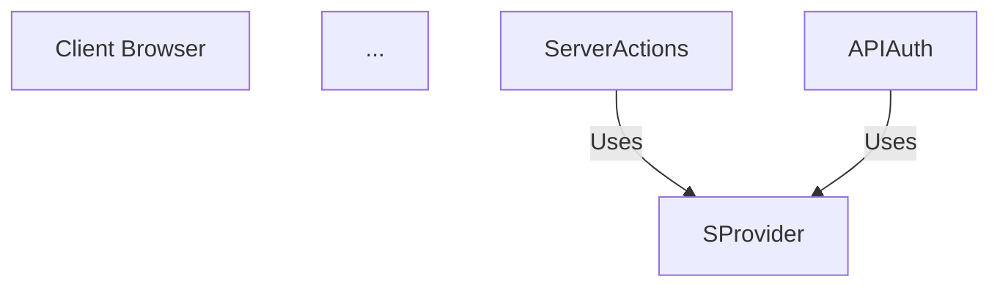
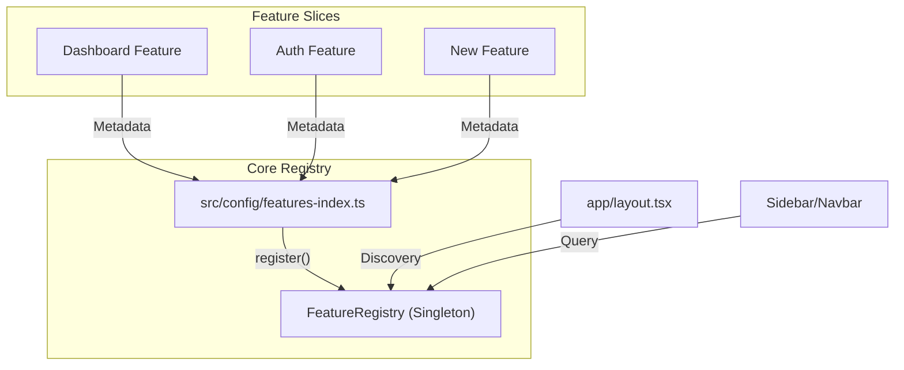

# DOCS(elevate-readme-architecture)

## Request
Improve the `README.md` to provide higher fidelity architectural references, ensuring it properly promotes and links to `ARCHITECTURE.md` while explaining the practical benefits of the system's design (Modular Feature-Slices, Hexagonal Auth). No emojis allowed.

## Directory Map
```text
README.md                         (modify)
```

## Modification Table
| File | Action | Why |
|---|---|---|
| README.md | modify | Elevate architectural section from a simple diagram to a functional guide that links deeply to ARCHITECTURE.md and explains the plugin registry model. |

## Existing Pattern Audit
- **Architecture**: The project uses a custom `FeatureRegistry` (singleton) and a `features-index.ts` (activator) which represents a "Plug-and-Play" modular pattern.
- **Tone**: Professional, technically dense, with no visual fluff (emojis).
- **Organization**: Sectioned by Mermaid diagrams followed by textual deep-dives.

## Execution Plan
### Step 1 — Rewrite Architectural Section
Move from a "Lifecycle" diagram to a "Modular Registry" diagram that explains the plugin system. Add a "Documentation Guide" that explicitly maps `ARCHITECTURE.md` sections to developer needs.

### Step 2 — Add "Adding New Features" Guide
Convert the abstract "Pattern" description into a 3-step technical guide for developers using the codebase.

## File-by-File Changes

### `README.md`
**Action:** Modify  
**Why:** The current README has a link to ARCHITECTURE.md, but it is buried and lacks context on why a developer should read it.  
**Impact:** Improves developer onboarding by making the modular architecture actionable.

#### Before
```md
### 1. Architectural Overview

Detailed design specifications can be found in the [Architecture Documentation](file:///Users/dev/Projects/multi-tenant-saas-starter/ARCHITECTURE.md).

The following diagram illustrates the unidirectional data flow from the client through the App Router into the protected domain layers.



### 2. Core Directory Structure
...
```

#### After
```md
## Architecture and Developer Guide

This application follows a configuration-driven, modular architecture. For a deep-dive into the technical specifications, class relationships, and database ER diagrams, refer to the [Full Architectural Specification](file:///Users/dev/Projects/multi-tenant-saas-starter/ARCHITECTURE.md).

### Modular Registry System

The UI and business logic are decoupled via a central discovery registry. This allows features to be toggled or swapped without modifying the root layout or navigation components.



### Extending the Platform

To add a new feature to the system, follow the standardized "Plug-and-Play" workflow:

1. **Create Slice**: Build your domain logic in `src/features/[feature-name]/`.
2. **Define Metadata**: Create a `registry.ts` in your slice that implements the `FeatureMetadata` interface.
3. **Activate**: Import and add your feature to the list in `src/config/features-index.ts`.

Detailed implementation rules are covered in [ARCHITECTURE.md Section 4: Feature Plugin System](file:///Users/dev/Projects/multi-tenant-saas-starter/ARCHITECTURE.md#4-feature-plugin-system).

### Hexagonal Authentication Layer

Identity management is isolated behind a Port/Adapter boundary (`src/auth/`). This prevents the application core from being "locked in" to the Better Auth implementation.

- **Port**: `src/auth/types.ts` defines the interface.
- **Adapter**: `src/auth/adapters/better-auth/` handles the implementation.
- **Injection**: `src/auth/server-provider.ts` and `client-provider.ts` expose the session logic to the app.

For visual mapping of these boundaries, see [ARCHITECTURE.md Section 3: Authentication Layer](file:///Users/dev/Projects/multi-tenant-saas-starter/ARCHITECTURE.md#3-authentication-layer-hexagonal).

## Project Structure
...
```

#### Reasoning
- Increases the prominence of `ARCHITECTURE.md` by linking to specific sections.
- Converts the diagram from a general "Next.js flow" (which is standard) to the "Registry flow" (which is unique to this project).
- Removes the need for the user to "guess" how to extend the code by providing the 3-step guide.

## Validation Plan
- Verify all relative links to `ARCHITECTURE.md` sections (Section 3, Section 4) work as expected in a Markdown preview.
- Ensure no emojis are introduced in the new copy.
- Check Mermaid syntax for the Registry diagram.

## Risk Notes
- **Link Rot**: If `ARCHITECTURE.md` headings change, these deep links will break. Mitigation: We just audited `ARCHITECTURE.md`, so headings are stable for now.

## Approval
Status: Awaiting explicit user approval. Do not implement yet.
